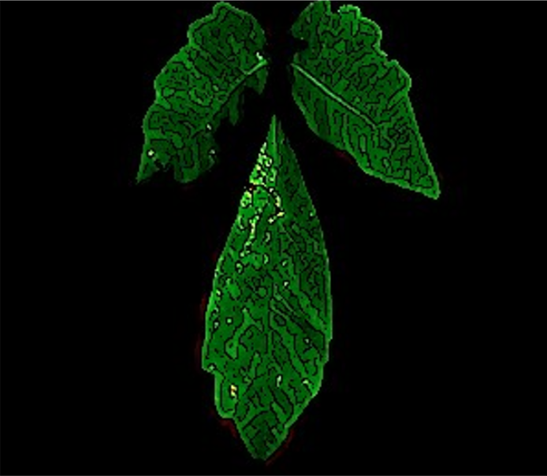
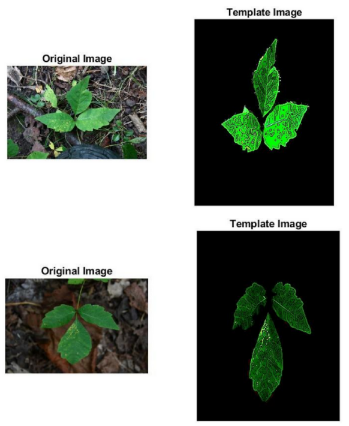
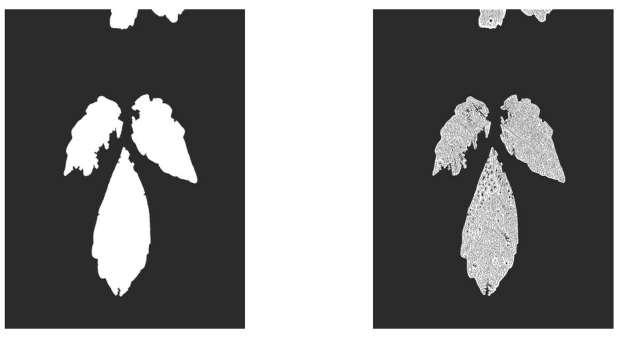
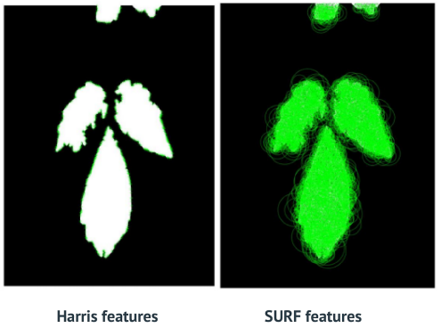
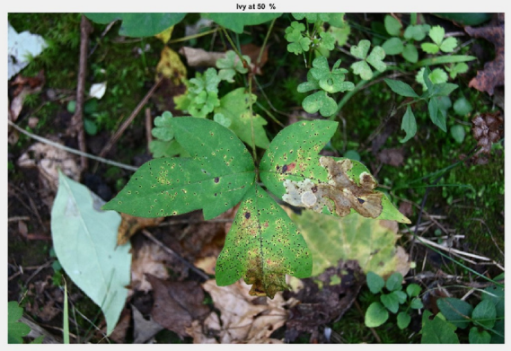
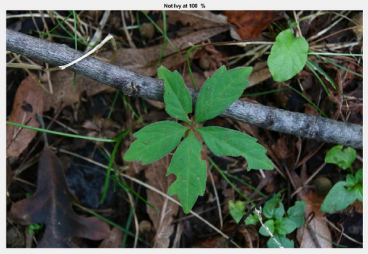

<h1 align="center">

</h1> 

# Poison Ivy Dectection using feature matching
This project delivers a MATLAB-based software that uses computer vision to quickly and accurately identify poison ivy from images. By analyzing leaf characteristics such as color, shape, and texture, the software effectively distinguishes poison ivy from other plants, helping to prevent allergic reactions. It processes and segments images, maps leaf edges and veins, and classifies them through advanced feature extraction.

<h1 align="center">

</h1> 

## 🔑 Key Feature

### Image Pre-processing: 
Cleans and prepares images for analysis.

### Leaf Segmentation: 
Isolates the leaf from the rest of the image to focus analysis on the relevant area

### Edge and Vein Mapping: 
Identifies and enhances the structural features of the leaf which are crucial for classification

### Feature Extraction and Mapping: 
Utilizes detailed characteristics like texture and vein patterns to build a profile of Haar and Surf feature

### Ivy Identification: 
Accurately classifies the leaf as poison ivy or not, based on the extracted features

## 🛠 Skills
MATLAB, Computer vision image processing, Haar features, Surf features , template matching

## 📃 Challenges I ran into
- Complex Image Processing: Ensuring accurate segmentation and feature extraction from varied and complex natural images.
- Classifier Accuracy: Achieving high accuracy in distinguishing between poison ivy and non-poison ivy leaves, particularly in diverse lighting and environmental conditions.

## 🔮 Future Scope
- Enhance Classification Efficiency: Refine the classification algorithms to improve accuracy and reduce false positives/negatives.
- Expand Template Database: Increase the number of template images for comparison to enhance the software’s adaptability to different types of poison ivy.
- Refine Leaf Isolation: Improve the segmentation process to isolate the leaf more cleanly from complex backgrounds.

